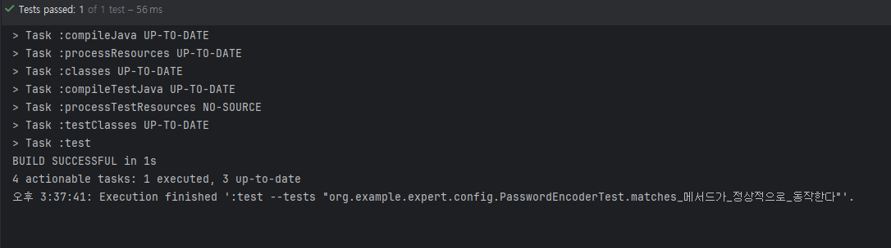
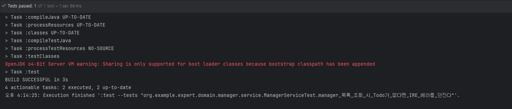
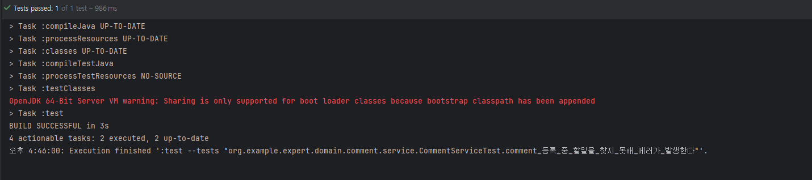
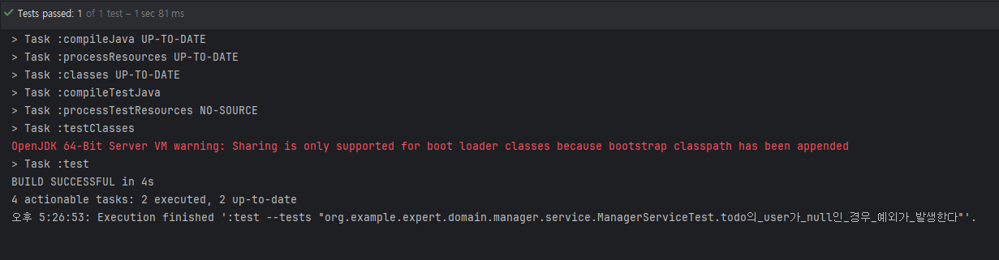
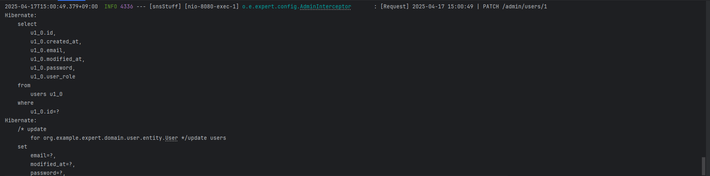
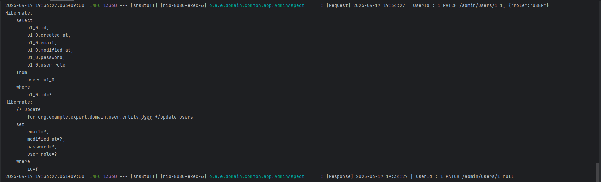

# Lv1. 코드 개선
### 1-1 : 코드 개선 퀴즈 - Early Return
package org.example.expert.domain.auth.service.AuthService; 의 'signup()'
### 1-2 : 리팩토링 퀴즈 - 불필요한 if-else 피하기
package org.example.expert.client.WeatherClient; 에 있는 'getTodayWeather()'
### 1-3 : 코드 개선 퀴즈 - Validation
package org.example.expert.domain.user.service.UserService; 의 'changePassword()'
package org.example.expert.domain.user.controller.UserController; 의 'changePassword()'
package org.example.expert.domain.user.dto.request.UserChangePasswordRequest;
# Lv2. N+1 문제

1) 코드 분석

* 개요 

  TodoRepository의 findAllByOrderByModifiedAtDesc()는, 
todos table 전체 중 일정 범위를 페이징하고 수정 일자 기준 내림차순으로 정렬하여 조회하는 메서드이다.

  하지만 이러한 조회는 지연로딩 즉시로딩을 불문하고, Todo Entity를 전체 조회하는 쿼리 + 각각의 Todo Entity의 수만큼 users table에 접근하는
쿼리가 DB에 중복으로 전달되어 DB 성능을 낮추는 결과를 불러오게 된다.

* Fetch Join

  본 메서드 상의 @Query()로 지칭된 JPQL은 위와 같은 N+1 문제를 어느 정도 방지하기 위해 Fetch Join 기능을 사용하고 있다.
  
   Fetch Join이란, JPQL에서 성능 최적화를 위해 fetch join을 제공하며 연관된 엔티티나 컬렉션을 SQL 한번으로 조회할 수 있도록 해주는 기능이다.

  fetch join 후 모든 Entity가 영속성 컨텍스트로 관리되며 Proxy 객체가 아닌, 진짜 Entity 객체를 조회한다.
  
*  Fetch Join과 Paging

   Fetch join을 사용하면 paging을 메모리에서 수행한다.
   조회 쿼리에서 페이징을 수행하는 limit절이 삭제되고, 전체를 조회한 후 메모리 상에서 요구된 페이지의 조회처리가 수행된다.
   따라서 필요없는 데이터까지 전체 로드하게 될 뿐만 아니라 서버의 메모리까지 사용되어 성능 하락의 문제가 발생한다.
* 결론
  위 메서드는 중복 쿼리를 전달하여 DB 성능을 낮추는 N+1의 문제가 발생할 수 있으므로 JPQL에서 Fetch Join을 사용하여 이를 방지하였으나,
 이는 페이징에서 전체 데이터 로드 후 메모리 상의 필터링을 수행하게 함을 이유로, 적절하지 못한 N+1 방지 대책이다.
  
2) @EntityGraph 기반의 구현으로 수정
   package org.example.expert.domain.todo.repository; 의 'findAllByOrderByModifiedAtDesc()'
  
# Lv3 테스트 코드 연습
1) 테스트코드 연습 -1(성공로직)

package test.java.org.example.expert.config.PasswordEncoderTest;

2) 테스트코드 연습 -2(예외로직)

1번 케이스

package test.java.org.example.expert.domain.manager.service.ManagerServiceTest;의 manager_목록_조회_시_Todo가_없다면_IRE_에러를_던진다()

2번 케이스

package test.java.org.example.expert.domain.comment.service.CommentServiceTest;의 comment_등록_중_할일을_찾지_못해_에러가_발생한다()

3번 케이스

package org.example.expert.domain.manager.service.ManagerService; 의 saveManager()
package test.java.org.example.expert.domain.manager.service.ManagerServiceTest; 의 todo의_user가_null인_경우_예외가_발생한다()

# Lv4. API 로깅
1) Interceptor
   
package org.example.expert.config.AdminInterceptor;
   package org.example.expert.config.WebConfig;

2) AOP

package org.example.expert.domain.common.aop.AdminAspect;
   package org.example.expert.domain.common.annotation.Admin;
   package org.example.expert.domain.user.controller.UserAdminController;
package org.example.expert.domain.comment.controller.CommentAdminController;

# Lv5. ‘내’가 정의한 문제와 해결 과정

1) 회원가입 비밀번호 요건 강화와 UserRole null 관련 리팩토링

a.[문제 인식 및 정의]

a-1 회원가입시 비밀번호 요건

비밀번호는 중요한 정보이므로, 더욱 강화된 보호와 요건이 필요하다.

1-3에서의 수정 또한 존재함으로 강화된 같은 요건으로 수정하지 않을 이유가 없다.

a-2 User Entity의 role 필드

시스템은 로그인한 사용자가 어떤 자격(ROLE_USER, ROLE_ADMIN 등)을 가지고 있는지를 기준으로 특정 API나 기능에 접근할 수 있는지를 판단한다.

이때 UserRole이 null이면 해당 사용자가 어떤 자격도 없는 것으로 간주되어,
인가 절차가 무력화되거나 예외 상황이 발생할 수 있다.

b.[해결 방안]

b-1 @Pattern 추가

package org.example.expert.domain.auth.dto.request.SignupRequest;

* 비밀번호 수정 요청과 같은 요건의 valid @Pattern으로 회원가입 요청의 비밀번호 필드를 제한

b-2 @Column(nullable = false), @NotBlank 추가

package org.example.expert.domain.user.entity.User;

package org.example.expert.domain.auth.dto.request.SignupRequest;

package org.example.expert.domain.user.dto.request.UserRoleChangeRequest;

* 도메인 관점에서 모든 유저는 최소 하나의 역할을 가지고 있어야 한다

  사용자가 회원가입을 하든, 어드민이 계정을 등록하든,
시스템에 등록된 이상 최소한의 권한(ROLE_USER 등)은 반드시 있어야 한다.

  또한 특정 API가 UserRole.ADMIN만 접근 가능하도록 설계되어 있을 때,
null 값은 그 어떤 역할도 아니므로 예외 처리 코드가 반드시 필요해진다.

  이건 불필요한 복잡도를 유발하고, 실수로 인한 보안 이슈로도 이어질 수 있다.

  이는 admin 계정의 유저 역할 수정 api 요청에서도 지켜져야 한다.

  그렇기 때문에 User Entity의 userRole 필드 상단에 @Column(nullable = false)를 추가하였고
SignupRequest의 userRole 필드 상단에 @Not Blank, UserRoleChangeRequest의 role 필드 상단에도 @Not Blank를 설정하였다.

c.[해결 완료]

c-1 회고

비밀번호와 UserRole은 애플리케이션에서 아주 중요하게 관리 되어야하는 필드들이다.

비밀번호는 더욱 제한적인 요건으로 보호 되어야 하며, userRole은 API 보안 및 정책 로직의 기준값이 되므로 도메인 설계 상에서도 필수값(non-nullable)으로 강제되어야 한다.

2) Todo와 Manager 관계 설계

a.[문제 인식 및 정의]

Todo를 생성하면 생성자는 자동으로 Manager로 등록되고,  
추가적으로 다른 유저를 매니저로 등록할 수 있는 API(`/todos/{todoId}/managers`)도 제공된다.

하지만 다음과 같은 문제점이 발견되었다.

문제점

| 항목 | 설명 |
|------|------|
| 불필요한 양방향 연관관계 | `Todo.managers` 컬렉션을 사용하지 않음에도 `@OneToMany`로 객체 그래프를 관리해야 함 |
| cascade = PERSIST 예외 가능성 | 외부에서 먼저 저장된 `Manager`가 다시 persist될 경우, `DetachedEntityPassedToPersistException` 발생 가능 |
| 도메인 책임 중복 | `Todo` 생성자와 `ManagerService` 모두에서 저장 책임을 가짐 |
| 중복 저장 가능성 | 같은 `(user, todo)` 조합이 여러 번 저장될 수 있음 (논리적 제약 없음) |

b.[해결 방안]

b-1.[의사결정 과정]

Q: cascade = PERSIST 유지해도 괜찮지 않나?

외부에서 이미 저장된 `Manager`를 cascade로 다시 persist 하려 할 경우 JPA 예외가 발생한다. → 명시적으로 저장하고 cascade 제거해야한다.

Q: @OneToMany로 유지할 필요가 있나?

Todo 안에 있는 List<Manager> 컬렉션은 실제 코드에서 전혀 사용되지 않고 있다.(todo.getManagers()를 호출해서 사용하는 코드가 프로젝트 전체에 없다.)

그런데 이 관계를 계속 유지하면, JPA가 Todo를 가져올 때마다 내부적으로 매니저 리스트도 추적하려고 한다.

예를 들어, Todo 100개를 불러오면 매니저 정보도 100번씩 추가 조회하게 돼서 불필요한 쿼리(N+1 문제) 가 생기고,
메모리에서도 Todo와 Manager의 연결을 계속 유지하려 해서 성능 낭비가 생길 수 있다.

그래서 Todo와 Manager의 양방향은 아예 제거하고, 필요할 때만 ManagerRepository를 통해 직접 조회하도록 리팩토링 하였다.

Q: 자동 등록과 수동 등록을 하나의 메서드로 합쳐도 되지 않나?

기능은 같지만 책임이 다르다. 하나는 내부 로직, 하나는 API 응답용이기 때문에 분리 유지한다.

Q: 중복 저장이 실제로 발생할 가능성이 있나?

사용자나 서버가 같은 요청을 두 번 보내는 상황이 생길 수 있다.

예를 들어, 사용자가 "일정 생성" 버튼을 두 번 클릭했거나,
네트워크가 느려서 한 번 요청한 게 중복 전송됐을 때,
혹은 테스트 코드에서 의도치 않게 saveSelfManager()를 두 번 호출하는 경우에도

Manager(user, todo)가 두 번 저장될 수 있는 가능성이 생긴다.

이걸 막지 않으면, 같은 유저가 같은 일정에 매니저로 여러 번 저장되는 이상한 상황이 생길 수 있다.

b-2.[해결 과정]

package org.example.expert.domain.todo.entity.Todo;

package org.example.expert.domain.todo.service.TodoService;

package org.example.expert.domain.manager.service.ManagerService;

package org.example.expert.domain.manager.repository.ManagerRepository;

package org.example.expert.domain.manager.entity.Manager;

| 조치 | 내용                                       |
|------|------------------------------------------|
| @OneToMany 제거 | Todo Entity에서 Manager 컬렉션 제거, 단방향 연관만 유지 |
| cascade = PERSIST 제거 | 저장은 모두 명시적으로 수행                          |
| ManagerService.registerSelfManager() 신설 | 자동 등록 책임을 서비스 계층으로 이전                    |
| existsByUserAndTodo() 쿼리 메서드 추가 | 저장 전 중복 여부 검사                            |
| @UniqueConstraint 도입 | DB 차원에서 중복 저장 완벽 차단                      |

c.[해결 완료]

   c-1.[회고]
   
연관관계를 단방향으로 정리하여 객체 그래프 단순화할 수 있었다.

cascade 제거 후 명시적 저장으로 예외 발생 가능성 제거하였다.

도메인 책임을 서비스 계층으로 이동으로 각자의 역할을 명확히 하였다.

중복 방지를 위한 논리적, 물리적 이중 방어 구조를 설계하였다.

# Lv6. 테스트 커버리지